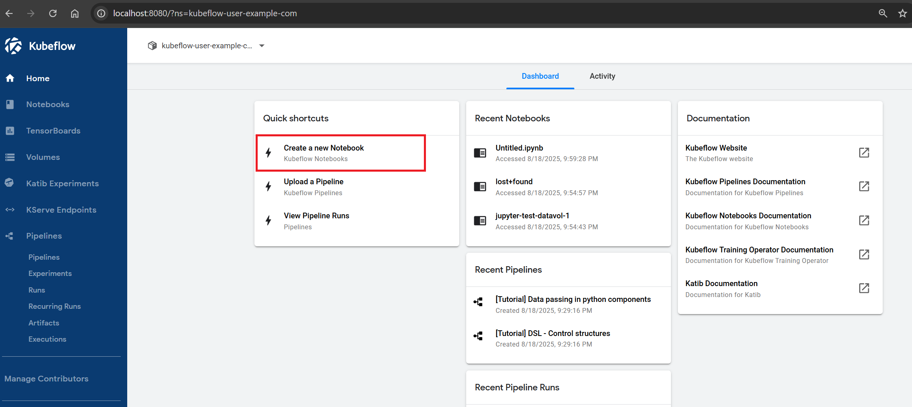
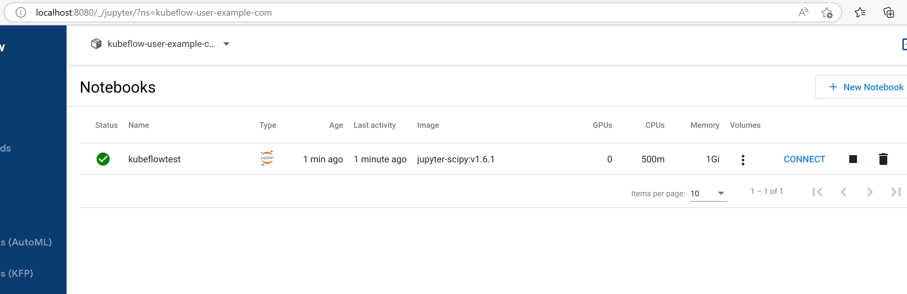

## Background

In this lab, you will use the [Azure CLI](https://docs.microsoft.com/cli/azure/install-azure-cli) to deploy an [Azure Kubernetes Service (AKS) Automatic](https://learn.microsoft.com/en-us/azure/aks/intro-aks-automatic) cluster. AKS Automatic offers a simplified, managed Kubernetes experience with automated node management, scaling, and security configurations. For more details, see the [AKS Automatic documentation](https://learn.microsoft.com/en-us/azure/aks/intro-aks-automatic). Note that AKS Automatic is currently in preview, while it provides faster setup and less manual configuration, it is not recommended for production use. For production workloads or when advanced features and customization are required, use regular AKS instead.
You will then install Kubeflow using the default settings using Kustomize and create a jupyter notebook server you can easily access on your browser. You will change default password and make kubeflow dashboard accessible using Ingress.

You can follow these same instructions to deploy Kubeflow on a non-automatic AKS cluster.

## Instructions for Basic Deployment with Default Password

This deployment option is for testing only. To deploy with TLS, and change default password, please click here: [Deploy kubeflow with TLS]().

⚠️ Warning: This deployment option would require users to have access to the kubernetes cluster. For a better deployment option that doesn't have this restriction, uses TLS and Ingress please head to the [Deploy kubeflow with TLS] option.


## Deploy AKS Automatic

Use the [Azure CLI](https://docs.microsoft.com/cli/azure/install-azure-cli) to deploy an [AKS Automatic](https://learn.microsoft.com/en-us/azure/aks/intro-aks-automatic) cluster. 

💡Note: In order to complete this deployment, you will need to have either  following permissions on Resource Group:
- Microsoft.Authorization/policyAssignments/write
- Microsoft.Authorization/policyAssignments/read.


For detailed instructions on installing AKS Automatic, please refer to the [AKS Automatic installation documentation](https://learn.microsoft.com/en-us/azure/aks/automatic/quick-automatic-managed-network?pivots=azure-cli).

Login to the Azure CLI.
```bash
az login
```

💡Note: If you have access to multiple subscriptions, you may need to run the following command to work with the appropriate subscription: `az account set --subscription <NAME_OR_ID_OF_SUBSCRIPTION>`.

Set up your environment variables

```bash
RGNAME=kubeflow
CLUSTERNAME=kubeflow-aks-automatic
LOCATION=eastus
```

Create the resource group

```bash
az group create -n $RGNAME -l $LOCATION
```

Add or Update AKS extension
```bash
az extension add --name aks-preview
```
This article requires the `aks-preview` Azure CLI extension version **9.0.0b4** or later.

Create an AKS Automatic cluster
```bash
az aks create \
    --resource-group $RGNAME \
    --name $CLUSTERNAME \
    --location $LOCATION \
    --sku automatic \
    --generate-ssh-keys 
```

💡Note: AKS Automatic is in Preview and requires feature to be registered in subscription.
```bash
az feature register --namespace Microsoft.ContainerService --name AutomaticSKUPreview
```


### Connect to AKS Automatic Cluster
After the cluster is created, you can connect to it using the Azure CLI. The following command retrieves the credentials for your AKS cluster and configures `kubectl` to use them.

```bash
az aks get-credentials --resource-group $RGNAME --name $CLUSTERNAME
```

Verify connectivity to the cluster. This should return a list of nodes.

```bash
kubectl get nodes
```

💡Note: With AKS Automatic, you don't need kubelogin as the cluster uses managed identity for authentication.

## Deploy KubeFlow

Clone this repo which includes the [kubeflow/manifests](https://github.com/kubeflow/manifests) repo as [Git Submodules](https://git-scm.com/book/en/v2/Git-Tools-Submodules)

```bash
git clone --recurse-submodules https://github.com/Azure/kubeflow-aks.git
```
💡Note: The `--recurse-submodules ` flag helps to get manifests from git submodule linked to this  repo 


Change directory into the newly cloned directory

```bash
cd kubeflow-aks
```


## Run Kubeflow Kustomize deployment

This deployment option is for testing only. To deploy with TLS, and change default password, please click here: [Deploy kubeflow with TLS]().

From the root of the repo, `cd` into kubeflow's  `manifests` directory and make sure you are in the `v1.10-branch`.

```bash
cd manifests/
git checkout v1.10-branch
cd ..
```

Install all of the components via a single command

```bash
cp -a deployments/vanilla manifests/vanilla
cd manifests/  
while ! kustomize build vanilla | kubectl apply --server-side=true -f -; do echo "Retrying to apply resources"; sleep 10; done
```

💡Note: The `--server-side=true` flag helps with large CRDs that may exceed annotation size limits. The retry loop handles dependency ordering issues during installation.

Once the command has completed, check the pods are ready

```bash
kubectl get pods -n cert-manager
kubectl get pods -n istio-system
kubectl get pods -n auth
kubectl get pods -n knative-eventing
kubectl get pods -n knative-serving
kubectl get pods -n kubeflow
kubectl get pods -n kubeflow-user-example-com
```
💡Note: Depending on the VM SKU automatic picked for your region it might scale up to 4 nodes to run all the Kubeflow components


## Access the Kubeflow dashboard
Run `kubectl port-forward` to access the Kubeflow dashboard

```bash
kubectl port-forward svc/istio-ingressgateway -n istio-system 8080:80
```

Finally, open [http://localhost:8080](http://localhost:8080/) and login with the default user's credentials. The default email address is `user@example.com` and the default password is `12341234`


## Testing the deployment with a Notebook server

You can test that the deployments worked by creating a new Notebook server using the GUI.

1. Click on "Create a new Notebook"


1. Click on "+ New Notebook" in the top right corner of the resulting page
1. Enter a name for the server
1. Leave the "jupyterlab" option selected
1. Feel free to pick one of the images available, in this case we choose the default
1. Set Requested CPU to 0.5 and requested memory in Gi to 1
1. Under Data Volumes click on "+ Add new volume"
1. Expand the resulting section
1. Set the name to datavol-1. The default name provided would not work because it has characters that are not allowed
1. Set the size in Gi to 1
1. Uncheck "Use default class"
1. Choose a class from the provided options. In this case I will choose `azurefile-premium`
1. Choose ReadWriteMany as the Access mode. Your data volume config should look like the picture below
    
1. Click on "Launch" at the bottom of the page. A successful deployment should have a green checkmark under status, after 1-2 minutes.
    
1. Click on "Connect" to access your jupyter lab
1. Under Notebook, click on Python 3 to access your jupyter notebook and start coding


## Change default password
⚠️ Warning: Update the default password before making this deployment accessible from outside the cluster.

To change the default password for the Kubeflow dashboard, you need to update the Dex configuration. 
1. First generate Password/Hashes by following steps described in `kubeflow` docs [using python to generate bcrypt hash](https://github.com/kubeflow/manifests/blob/master/README.md#change-default-user-password). Or for simplicity you can use an online tool like [bcrypt-generator](https://www.bcrypt-generator.com/) to create a new hash.

```bash
pip3 install passlib
python3 -c 'from passlib.hash import bcrypt; import getpass; print(bcrypt.using(rounds=12, ident="2y").hash(getpass.getpass()))'

Password: ***
$2y$12$XXXXXXXXXXXXXXXXXXX
```
2. Delete existing password
```bash
kubectl delete secret dex-passwords -n auth
```
3. Create new password secret
```bash
kubectl create secret generic dex-passwords --from-literal=DEX_USER_PASSWORD='REPLACE_WITH_HASH' -n auth
```
4. Restart the Dex deployment to pick up the new password secret:
```bash
kubectl rollout restart deployment dex -n auth
```

To add more users 
1. update `dex` config map `deployments/vanilla/dex-config-map.yaml` with more entries in user array:

```
    staticPasswords:
    - email: user@example.com
      hashFromEnv: DEX_USER_PASSWORD
      username: user
      userID: "15841185641784"
      # Add more users here
    - email: user2@example.com
        hashFromEnv: DEX_USER2_PASSWORD
        username: user2
        userID: "15841185641785"
```

2. Update `DEX_USER2_PASSWORD` with the new password hash.

```bash
kubectl patch secret dex-passwords -n auth --type='json' -p='[{"op": "replace", "path": "/data/DEX_USER2_PASSWORD", "value":"'$(echo -n 'REPLACE_WITH_HASH' | base64)'"}]'
```
3. Apply config map and restsrt deployment

```bash
kubectl apply -f deployments/vanilla/dex-config-map.yaml
kubectl rollout restart deployment dex -n auth
```

## Expose the Kubeflow dashboard using Ingress

AKS Automatic includes the **nginx ingress controller** as part of the **app-routing-system** addon, which makes it easy to expose Kubeflow externally without port-forwarding.

### Create an Ingress resource for Kubeflow

1. Create and apply an ingress manifest to expose the Kubeflow dashboard:

```bash
echo 'apiVersion: networking.k8s.io/v1
kind: Ingress
metadata:
  name: kubeflow-ingress
  namespace: istio-system
  annotations:
    nginx.ingress.kubernetes.io/rewrite-target: /
    nginx.ingress.kubernetes.io/ssl-redirect: "false"
spec:
  ingressClassName: webapprouting.kubernetes.azure.com
  rules:
  - http:
      paths:
      - path: /
        pathType: Prefix
        backend:
          service:
            name: istio-ingressgateway
            port:
              number: 80' | kubectl apply -f -
```

2. Get the external IP address of the nginx ingress controller:

```bash
kubectl get ingress kubeflow-ingress -n istio-system
```

Wait for the `ADDRESS` field to show an external IP address (this may take a few minutes).

```
NAME               CLASS                                HOSTS   ADDRESS       PORTS   AGE
kubeflow-ingress   webapprouting.kubernetes.azure.com   *       xxx.149.0.222   80      16m
```

3. Access Kubeflow using the external IP:

Once the IP is available, you can access Kubeflow directly via: `http://<EXTERNAL-IP>`

💡Note: With AKS Automatic's app-routing-system, you get a managed nginx ingress controller without needing to install or configure it manually. This provides external access to Kubeflow without using port-forwarding.

⚠️ Warning: This exposes Kubeflow publicly on the internet. Make sure to change the default password before doing this, and consider using TLS certificates for production deployments.

### Optional: Use Azure DNS for a friendly URL

You can also configure a custom domain name using Azure DNS:

```bash
kubectl annotate service nginx -n app-routing-system \
  service.beta.kubernetes.io/azure-dns-label-name=my-kubeflow-cluster
```

This will make Kubeflow accessible at: `http://my-kubeflow-cluster.$LOCATION.cloudapp.azure.com`


💡Note: DNS Label must be unique for the Azure region.

## Next steps
[Deploy with TLS]() deployment option.
