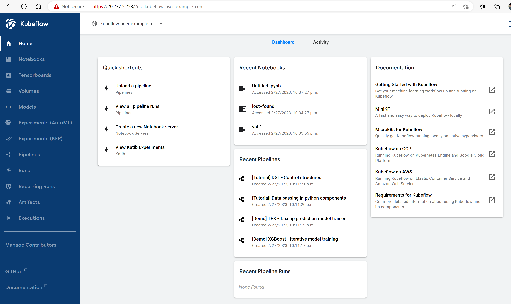
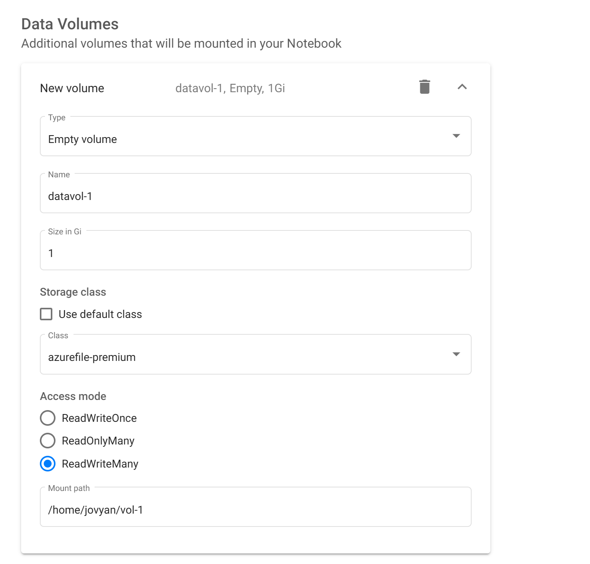
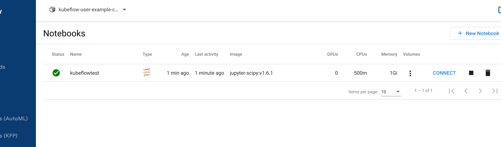

# Deploy Kubeflow with Password, Ingress and TLS

Use the [Azure CLI](https://docs.microsoft.com/cli/azure/install-azure-cli) and [Bicep](https://docs.microsoft.com/azure/azure-resource-manager/bicep/overview) templates to deploy the infrastructure for your application. We will be using the [AKS construction](https://github.com/Azure/AKS-Construction) project to rapidly deploy the required Azure resources. The project allows users the flexibility to tweak their AKS environment however they want. Please check out the [AKS construction helper](https://azure.github.io/AKS-Construction/) for more details about AKS construction.

You can also try out the automated option using [Mage](https://magefile.org/) build tool at the [Azure Open Source Labs](https://github.com/Azure-Samples/azure-opensource-labs/tree/main/cloud-native/aks-kubeflow#kubeflow-on-azure-kubernetes-service-aks).

Login to the Azure CLI.

```bash
az login
```

> :bulb: If you have access to multiple subscriptions, you may need to run the following command to work with the appropriate subscription:
>
> `az account set --subscription <NAME_OR_ID_OF_SUBSCRIPTION>`

Install kubectl using the Azure CLI, if required.

```bash
az aks install-cli
```

Clone this repo which includes the [Azure/AKS-Construction](https://github.com/Azure/AKS-Construction) and [kubeflow/manifests](https://github.com/kubeflow/manifests/tree/v1.6-branch) repos as [Git Submodules](https://git-scm.com/book/en/v2/Git-Tools-Submodules)

```bash
git clone --recurse-submodules https://github.com/Azure/kubeflow-aks.git
```

## Deployment steps

Get the signed in user id so that you can get admin access to the cluster you create

```bash
SIGNEDINUSER=$(az ad signed-in-user show --query id --out tsv)
RGNAME=kubeflow
```

Create deployment

```bash
az group create -n $RGNAME -l eastus
DEP=$(az deployment group create -g $RGNAME --parameters signedinuser=$SIGNEDINUSER -f main.bicep -o json)
```

> :bulb: The DEP variable is very important and will be used in subsequent steps. You can save it by running `echo $DEP > test.json` and restore it by running `export DEP=$(cat test.json)`

```bash
KVNAME=$(echo $DEP | jq -r '.properties.outputs.kvAppName.value')
AKSCLUSTER=$(echo $DEP | jq -r '.properties.outputs.aksClusterName.value')
TENANTID=$(az account show --query tenantId -o tsv)
ACRNAME=$(az acr list -g $RGNAME --query "[0].name"  -o tsv)
```

## Install kubelogin
Next install kubelogin using the [installation instructions](https://github.com/Azure/kubelogin) appropriate for your computer. From there, you'll need to run the following commands to download the kubeconfig file and convert it for use with kubelogin.

```bash
az aks get-credentials --resource-group $RGNAME \
  --name $AKSCLUSTER

kubelogin convert-kubeconfig -l azurecli
```

## Install kustomize

Next install kustomize using the [installation instructions](https://kubectl.docs.kubernetes.io/installation/kustomize/) appropriate for your computer.

> :bulb: In order to use the `kustomize` command below to deploy Kubeflow, you must use [Kustomize v3.2.0](https://github.com/kubernetes-sigs/kustomize/releases/tag/v3.2.0). More info [here](https://github.com/kubeflow/manifests#prerequisites).

## Install kubelogin with TLS and Unique Password
It is assumed you have completed the steps in the main [README](./README.md) file up to point where you deployed installed Kustomize. Follow the steps below to deploy kubeflow and provide access to it with TLS. Please note that a self-signed certificate is used for demonstration purposes. Do not use self signed certs for production workloads. You can easily swap this self-signed cert with your CA certificate for your usecase.

For this deployment, we will be using a simple method for authenticating to Kubeflow. For more advanced usecases, please configure your deployment to use Azure AD.

1. The first step is to generate a new Hash/Password combination using bycrypt. There are many ways of doing this, eg by generating it [using python](https://github.com/kubeflow/manifests/blob/master/README.md#change-default-user-password). For simplicity we will be using coderstool's [Bycrypt Hash Generator](https://www.coderstool.com/bcrypt-hash-generator) for testing purposes. Do not do this for production workloads. In the plain text field, enter a password for your first user, then click on the "Generate Hash" button. You can generate multiple if you have multiple users.
    
1. Head to the tls-manifest/manifests/common/dex/base/config-map.yaml file and update the hash value there (around line 22) with the hash you just generated. You can also change the email address, username and userid. In addition, you can setup multiple users by adding more users to the array.
1. Update your auth.md file with the new email address and password (plain text password not hash) or store the secrets in a more secure way
1. Copy the contents of this newly updated manifests folder to the kubeflow manifests folder. This will update the files so the deployment includes your config changes.
    ```bash
    cp -r tls-manifest/manifests/ manifests/
    ```
1. cd to the manifests folder and install kubeflow
    ```bash
    cd manifests
    ```
    Install all of the components via a single command
    
    ```bash
    while ! kustomize build example | kubectl apply -f -; do echo "Retrying to apply resources"; sleep 10; done
    ```  
1. Once the command has completed, check the pods are ready
    
    ```bash
    kubectl get pods -n cert-manager
    kubectl get pods -n istio-system
    kubectl get pods -n auth
    kubectl get pods -n knative-eventing
    kubectl get pods -n knative-serving
    kubectl get pods -n kubeflow
    kubectl get pods -n kubeflow-user-example-com
    ```
1. Restart dex to ensure dex is using the updated password
    It is important that you restart the dex pod by running the command below. If you don't any previous password (including the default password 12341234 if not changed) will be used from the time the Service is exposed via `LoadBalancer` until the time this command is run or the dex is otherwise restarted.
    ```bash
    kubectl rollout restart deployment dex -n auth
    ```
1. Configure TLS. Start by getting IP address of istio gateway
    ```bash
    IP=$(kubectl -n istio-system get service istio-ingressgateway --output jsonpath={.status.loadBalancer.ingress[0].ip})
    ```
    Replace the IP address in the tls-manifest/certificate.yaml file with the IP address of the istio gateway using the sed command below 
    > :warning: If you are using a mac you will need to change the command to `sed -i '' "s/192.168.0.5/$IP/" tls-manifest/certificate.yaml `. 
    
    > :bulb: If these sed commands don't work for any reason or if you don't have sed installed, you will need to update these files manually by replacing the placeholders in the files mentioned below.
    ```bash
    cd ..
    sed -i  "s/192.168.0.5/$IP/" tls-manifest/certificate.yaml 
    ```
1. Please note that instead of providing the IP address like we did above, you could give the LoadBalancer an Azure sub-domain (via the annotation in tls-manifest/manifests/common/istio-1-14/istio-install/base/patches/service.yaml ) and use that too. Deploy the certificate manifest file.
    ```bash
    cd ..
    kubectl apply -f  tls-manifest/certificate.yaml 
    ```
1. You have completed the deployment. Access the dashboard by entering the IP address in a browser. You might get a warning saying the connection is unsafe. This is expected since you are using a self signed certificate. Click on advanced and proceed to the URL to view your dashboard. Log in using the email address and password in the auth.md file (assuming you updated it with your email address and password in the previous step)
    

## Testing the deployment with a Notebook server
You can test that the deployments worked by creating a new Notebook server using the GUI.

1. Click on "Create a new Notebook server"
    
1. Click on "+ New Notebook" in the top right corner of the resulting page
1. Enter a name for the server
1. Leave the "jupyterlab" option selected
1. Feel free to pick one of the images available, in this case we choose the default
1. Set Requested CPU to 0.5 and requested memory in Gi to 1
1. Under Data Volumes click on "+ Add new volume"
1. Expand the resulting section
1. Set the name to datavol-1. The default name provided would not work because it has characters that are not allowed
1. Set the size in Gi to 1
1. Uncheck "Use default class"
1. Choose a class from the provided options. In this case I will choose "azurefile-premium"
1. Choose ReadWriteMany as the Access mode. Your data volume config should look like the picture below
    
1. Click on "Launch" at the bottom of the page. A successful deployment should have a green checkmark under status, after 1-2 minutes.
    
1. Click on "Connect" to access your jupyter lab
1. Under Notebook, click on Python 3 to access your jupyter notebook and start coding

## Destroy the resources
Run the command below to destroy the resources you just created after you are done testing

```azurecli
az group delete -n $RGNAME
```