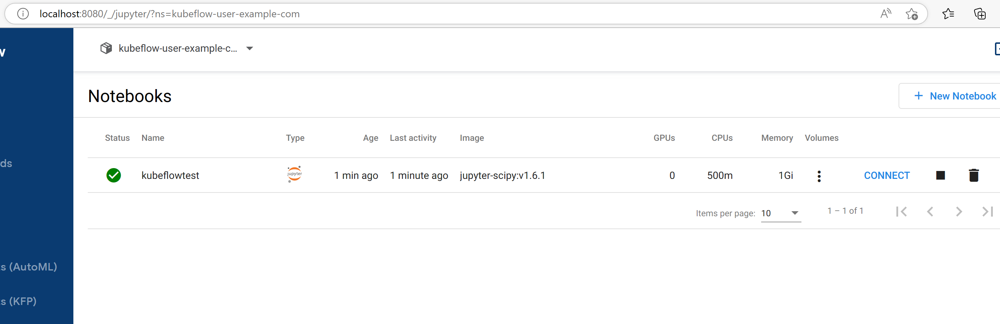

## Background

In this lab you will deploy an Azure Kubernetes Service (AKS) cluster and other Azure services (Container Registry, Managed Identity, Key Vault) with [Azure CLI](https://docs.microsoft.com/cli/azure/install-azure-cli) and [Bicep](https://docs.microsoft.com/azure/azure-resource-manager/bicep/overview). You will then install Kubeflow using the default settings using Kustomize and create a jupyter notebook server you can easily access on your browser.

## Instructions for Basic Deployment without TLS and with Default Password

This deployment option is for testing only. To deploy with TLS, and change default password, please click here: [Deploy kubeflow with TLS](./Deploy-with-tls.md).

This deployment option would require users to have access to the kubernetes cluster. For a better deployment option that doesn't have this restriction, uses TLS and shows how to change default password, please head to the [Deploy kubeflow with TLS](../custom-password-tls/index.md) option.

Use the [Azure CLI](https://docs.microsoft.com/cli/azure/install-azure-cli) and [Bicep](https://docs.microsoft.com/azure/azure-resource-manager/bicep/overview) templates to deploy the infrastructure for your application. We will be using the [AKS construction](https://github.com/Azure/AKS-Construction) project to rapidly deploy the required Azure resources. The project allows users the flexibility to tweak their AKS environment however they want. Please check out the [AKS construction helper](https://azure.github.io/AKS-Construction/) for more details about AKS construction.

Login to the Azure CLI.

```bash
az login
```

If you have access to multiple subscriptions, you may need to run the following command to work with the appropriate subscription: `az account set --subscription <NAME_OR_ID_OF_SUBSCRIPTION>`. 

Install kubectl using the Azure CLI, if required.

```bash
az aks install-cli
```

Clone this repo which includes the [Azure/AKS-Construction](https://github.com/Azure/AKS-Construction) and [kubeflow/manifests](https://github.com/kubeflow/manifests/tree/v1.6-branch) repos as [Git Submodules](https://git-scm.com/book/en/v2/Git-Tools-Submodules)

```bash
git clone --recurse-submodules https://github.com/Azure/kubeflow-aks.git
```

## Deployment steps

Get the signed in user id so that you can get admin access to the cluster you create

```bash
SIGNEDINUSER=$(az ad signed-in-user show --query id --out tsv)
RGNAME=kubeflow
```

Create deployment

```bash
az group create -n $RGNAME -l eastus
DEP=$(az deployment group create -g $RGNAME --parameters signedinuser=$SIGNEDINUSER -f main.bicep -o json)
```

The DEP variable is very important and will be used in subsequent steps. You can save it by running `echo $DEP > test.json` and restore it by running `export DEP=$(cat test.json)`. 

```bash
KVNAME=$(echo $DEP | jq -r '.properties.outputs.kvAppName.value')
AKSCLUSTER=$(echo $DEP | jq -r '.properties.outputs.aksClusterName.value')
TENANTID=$(az account show --query tenantId -o tsv)
ACRNAME=$(az acr list -g $RGNAME --query "[0].name"  -o tsv)
```

## Install kubelogin
Next install kubelogin using the [installation instructions](https://github.com/Azure/kubelogin) appropriate for your computer. From there, you'll need to run the following commands to download the kubeconfig file and convert it for use with kubelogin.

```bash
az aks get-credentials --resource-group $RGNAME \
  --name $AKSCLUSTER

kubelogin convert-kubeconfig -l azurecli
```

## Install kustomize

Next install kustomize using the [installation instructions](https://kubectl.docs.kubernetes.io/installation/kustomize/) appropriate for your computer.

In order to use the `kustomize` command below to deploy Kubeflow, you must use [Kustomize v3.2.0](https://github.com/kubernetes-sigs/kustomize/releases/tag/v3.2.0). More info [here](https://github.com/kubeflow/manifests#prerequisites). 

## Deploy Kubeflow without TLS using Default Password

This deployment option is for testing only. To deploy with TLS, and change default password, please click here: [Deploy kubeflow with TLS](./Deploy-with-tls.md).

From the root of the repo, `cd` into kubeflow's  `manifests` directory and make sure you are in the `v1.6-branch`.

```bash
cd manifests/
git checkout v1.6-branch
```

Install all of the components via a single command

```bash
while ! kustomize build example | kubectl apply -f -; do echo "Retrying to apply resources"; sleep 10; done
```

Once the command has completed, check the pods are ready

```bash
kubectl get pods -n cert-manager
kubectl get pods -n istio-system
kubectl get pods -n auth
kubectl get pods -n knative-eventing
kubectl get pods -n knative-serving
kubectl get pods -n kubeflow
kubectl get pods -n kubeflow-user-example-com
```

Run `kubectl port-forward` to access the Kubeflow dashboard

```bash
kubectl port-forward svc/istio-ingressgateway -n istio-system 8080:80
```

Finally, open [http://localhost:8080](http://localhost:8080/) and login with the default user's credentials. The default email address is `user@example.com` and the default password is `12341234`

## Testing the deployment with a Notebook server
You can test that the deployments worked by creating a new Notebook server using the GUI.

1. Click on "Create a new Notebook server"


1. Click on "+ New Notebook" in the top right corner of the resulting page
1. Enter a name for the server
1. Leave the "jupyterlab" option selected
1. Feel free to pick one of the images available, in this case we choose the default
1. Set Requested CPU to 0.5 and requested memory in Gi to 1
1. Under Data Volumes click on "+ Add new volume"
1. Expand the resulting section
1. Set the name to datavol-1. The default name provided would not work because it has characters that are not allowed
1. Set the size in Gi to 1
1. Uncheck "Use default class"
1. Choose a class from the provided options. In this case I will choose "azurefile-premium"
1. Choose ReadWriteMany as the Access mode. Your data volume config should look like the picture below
    
1. Click on "Launch" at the bottom of the page. A successful deployment should have a green checkmark under status, after 1-2 minutes.
    
1. Click on "Connect" to access your jupyter lab
1. Under Notebook, click on Python 3 to access your jupyter notebook and start coding

## Next steps
[Secure your kubeflow cluster using TLS and stronger Password]() deployment option. 
